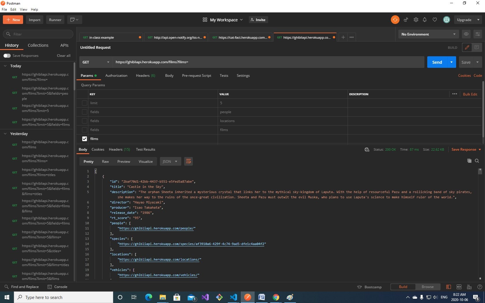

# Citation

## Stackoverflow to output data from Array

https://stackoverflow.com/questions/35597395/extract-data-from-php-array

## To check whats coming from $animeList (1st if statment) place following code between lines 51 and 53 inside index.php
```
<pre>
    <?php
    print_r($animeList);
    ?>
</pre>
```
## To check whats coming from $animeList (2nd if statment) place following code between lines 113 and 115 inside index.php
```
?>
    <pre>
        <?php
        print_r($animeList);
        ?>
    </pre>
<?php
```
## Code that didn't work inside 1st if statment, that's why i created separate if statment to handle just Films category

```
        <?php
            if ($_GET['fields'] =='films'): 
            ?>
            <ol>
                <?php foreach ( $animeList as $fields ) : ?>
                    <?php
                        foreach ($fields->films as $url) : ?>
                        
                    <li>
                        <?php echo $url; ?>
                    </li>
                    <?php endforeach;  ?>
                <?php endforeach;  ?>
            </ol>
            <?php endif; ?>
```

## Screenshots of Postman calls from API

